# Task Queue

Utilisation:
- Une seule tache active a la fois.
- Je traite uniquement la tache marquee `status: in_progress`.
- Les taches suivantes restent en `pending` jusqu'a ta validation explicite.
- Tu peux demander des ajustements sur la tache en cours sans casser la sequence.
- Pour passer a la suivante, ecris par exemple: `valide 1` ou `on passe a la 2`.

## Statuts

- `pending`: en attente
- `in_progress`: tache active
- `blocked`: bloquee par une question ou une dependance
- `approved`: validee par toi, prete a etre archivee
- `done`: completement terminee

---

## Task 1

status: approved
instructions:
- la bande de logos qui défile sur l'accueil ne fait pas une boucle infinie. au bout d'un moment, il y a un vide derrière le dernier logo à droite et le défilement saute, puis recommence, peut on améliorer ça ?
- voir capture :
  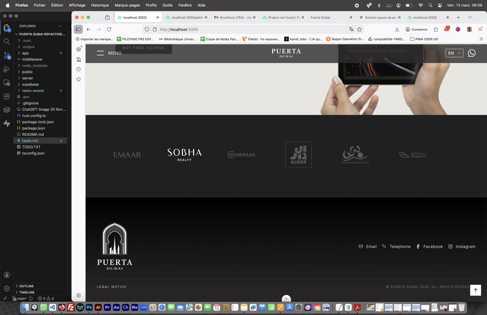

contraintes:
- attendre validation avant de passer a la tache suivante

validation attendue:
- ecris `valide 1` pour autoriser le passage a la tache suivante

---

## Task 2

status: approved
instructions:
- pour la section golden visa à l'accueil, il faudrait reprendre ce texte :
-  "Discover our free, interactive guide to the UAE Golden Visa — your step-by-step resource to secure long-term residence, understand eligibility, and explore investment opportunities in the Emirates.

Special offer: Receive complimentary Golden Visa processing when purchasing a property above USD 550,000 or depositing 10% of that value. "

contraintes:
- ne demarrer qu'apres validation de la tache precedente

validation attendue:
- ecris `valide 2` pour autoriser le passage a la tache suivante

---

## Task 3

status: approved
instructions:
- il y a une série de boutons dont le fond est noir par défaut, et au survol, il y a un effet de bande qui passe et le texte devient noir aussi mais illisible, peux tu passer le texte en "rosé champagne" au survol
- voir capture :
  

contraintes:
- ne demarrer qu'apres validation de la tache precedente

validation attendue:
- ecris `valide 3` pour autoriser le passage a la tache suivante

---

## Task 4

status: approved
instructions:
- Dans la section "why dubai - key avantages" de l'accueil, j'aimerais que tu reprennes l'effet sur le fond que tu as utilisé pour la connexion au back office
- voir captures :
  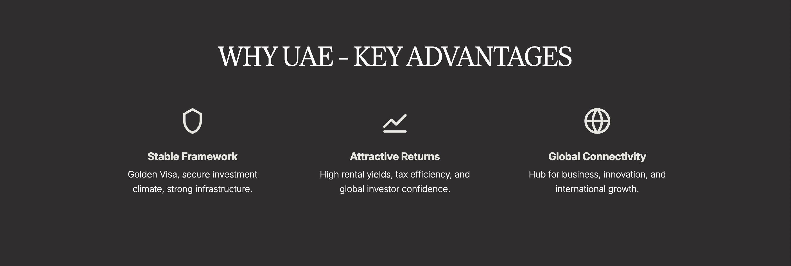
   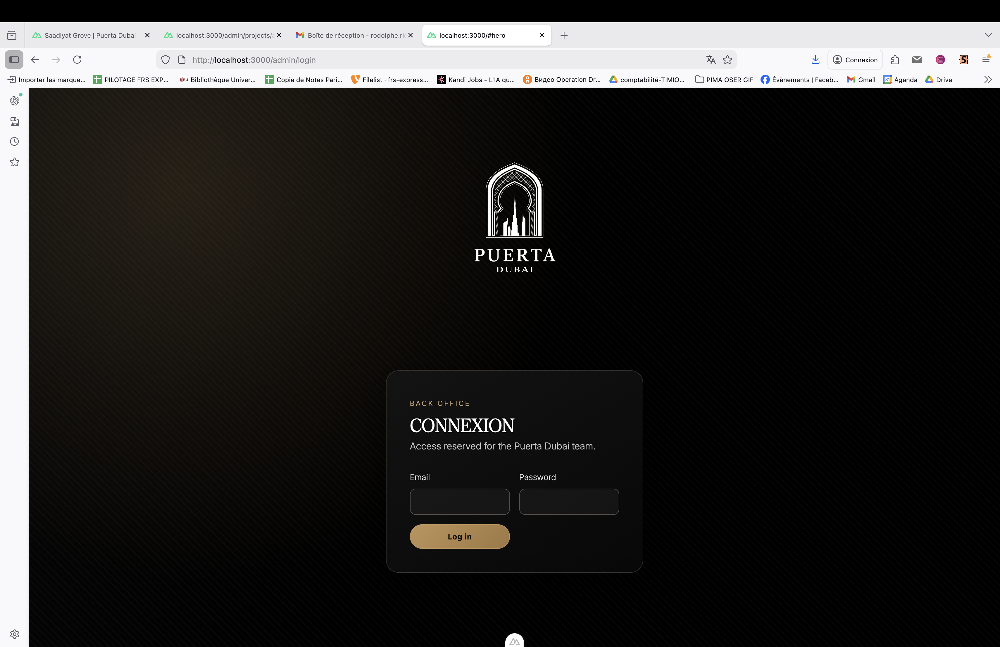

contraintes:
- ne demarrer qu'apres validation de la tache precedente

validation attendue:
- ecris `valide 4` pour autoriser le passage a la tache suivante

---
## Task 5

status: approved
instructions:
- Pour le preloader, j'aimerais que celui-ci soir avec un z-index plus élevé que tout le reste, notamment le menu de nav principal. Aussi, je voudrais que la barre blanche horizontale, indique réellement le niveau de chargement de la page et des médias. Particulièrement pour les pages de projets qui contiennent des images appellées dans supabase

contraintes:
- ne demarrer qu'apres validation de la tache precedente

validation attendue:
- ecris `valide 5` pour autoriser le passage a la tache suivante

---
## Task 6

status: approved
instructions:
- pour le footer, je souhaite que le dégradé aille de gauche à droite, du carbon au noir pur et la couleur du logo doit être inversée
- voir capture :
  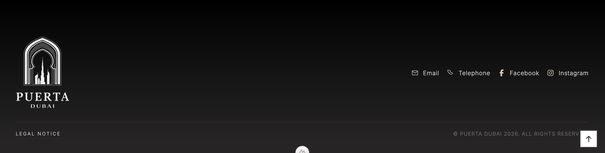

contraintes:
- ne demarrer qu'apres validation de la tache precedente

validation attendue:
- ecris `valide 6` pour autoriser le passage a la tache suivante

---
## Task 7

status: approved
instructions:
- dans les pages détails de projets, les vignettes pour appeler d'autres projets, n'ont pas un aspect homogène
- voir capture :
  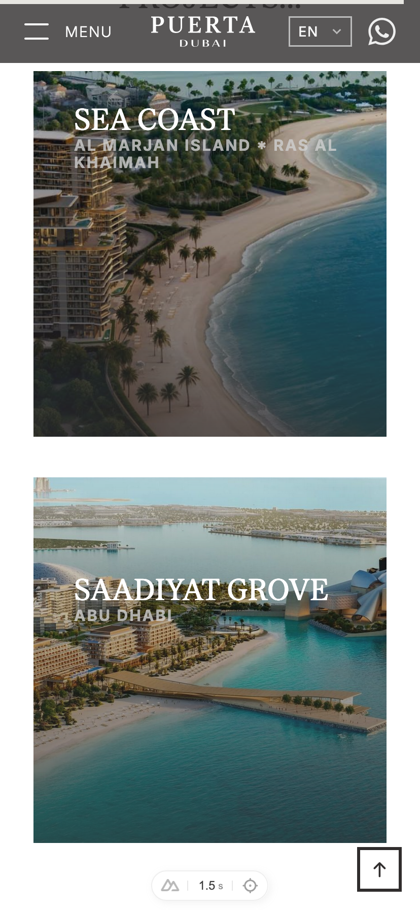

contraintes:
- ne demarrer qu'apres validation de la tache precedente

validation attendue:
- ecris `valide 7` pour autoriser le passage a la tache suivante

---
## Task 8

status: approved
instructions:
- je voudrais masque le fil d'arianne, uniquement sur la home page, pas sur les autres pages internes
- voir capture :
  

contraintes:
- ne demarrer qu'apres validation de la tache precedente

validation attendue:
- ecris `valide 8` pour autoriser le passage a la tache suivante

---
## Task 9

status: approved
instructions:
- sur le login du back office, je veux que la page soit en anglais et non pas en français

contraintes:
- ne demarrer qu'apres validation de la tache precedente

validation attendue:
- ecris `valide 9` pour autoriser le passage a la tache suivante

---
## Task 10

status: approved
instructions:
- sur l'accueil, la section "lastest news" doit plutôt être nommée "press releases"

contraintes:
- ne demarrer qu'apres validation de la tache precedente

validation attendue:
- ecris `valide 10` pour autoriser le passage a la tache suivante

---
## Task 11

status: approved
instructions:
- au chargement de la page d'accueil, peut-on faire un effet "textilate", très léger et doux d'apparition de chaque lettres sur le titre "invest the vision of UAE"

contraintes:
- ne demarrer qu'apres validation de la tache precedente

validation attendue:
- ecris `valide 11` pour autoriser le passage a la tache suivante

---
## Task 12

status: approved
instructions:
Je veux que la section "OUR SERVICES" de l'accueil vienne se loger juste avant "Dayan Candamil"

contraintes:
- ne demarrer qu'apres validation de la tache precedente

validation attendue:
- ecris `valide 12` pour autoriser le passage a la tache suivante

---

## Task 13

status: approved
instructions:
-je veux plusieurs optimisations sur la page liste de projets : j'aimerais que le titre principal ne chevauche pas la ligne du fil d'ariane, une petite marge en haut peut-être
- sur la version mobile, je veux, pour éviter de perturber le scroll utilisateur dans la page, désactiver le ballayage sur la carte openstreet map
- pour les tuiles des projets, je veux que l'affichage, par défaut, ou au survol soit mieux agencé, maitrisé
- voir capture :
  
contraintes:
- ne demarrer qu'apres validation de la tache precedente

validation attendue:
- ecris `valide 13` pour autoriser le passage a la tache suivante

---
## Task 14

status: approved
instructions:
- sur mobile Android, le header fixe recouvre trop souvent le contenu des pages internes: hero, fil d'ariane, titres et parfois même les premiers paragraphes passent sous la barre du haut
- je veux que tu recalibres la hauteur du header mobile, la safe area et surtout l'offset vertical des premières sections pour que rien ne soit masqué au chargement ni pendant le scroll
- voir captures :
  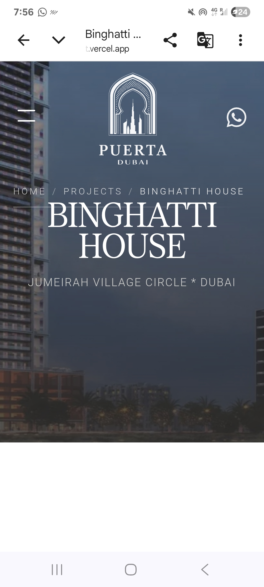
  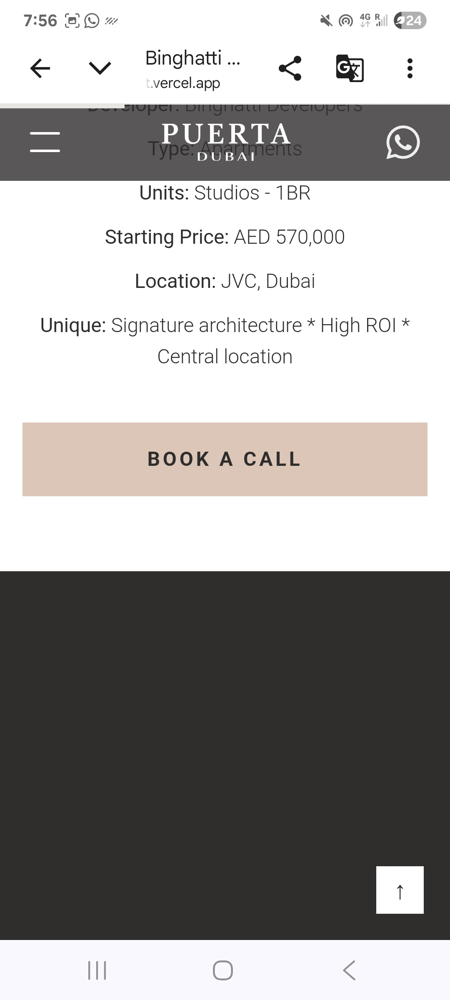
  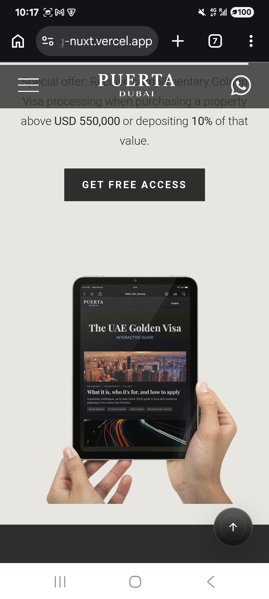
  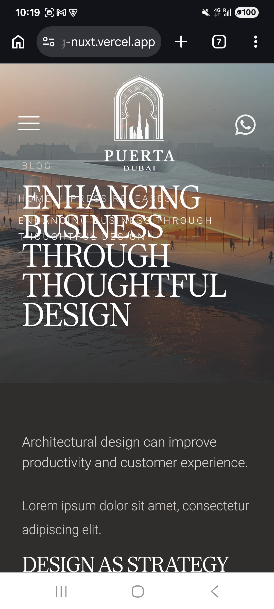
  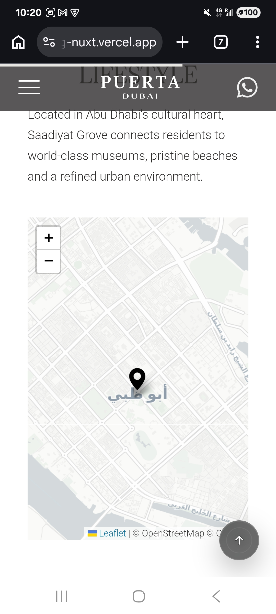

contraintes:
- ne demarrer qu'apres validation de la tache precedente

validation attendue:
- ecris `valide 14` pour autoriser le passage a la tache suivante

---
## Task 15

status: approved
instructions:
- sur la page "press releases" en mobile, le fil d'ariane et le titre principal se superposent et on voit un doublon visuel de "PRESS RELEASES"
- je veux une version mobile propre, avec une hierarchie lisible entre breadcrumb, separateur et titre de page, sans texte fantome ni chevauchement
- voir captures :
  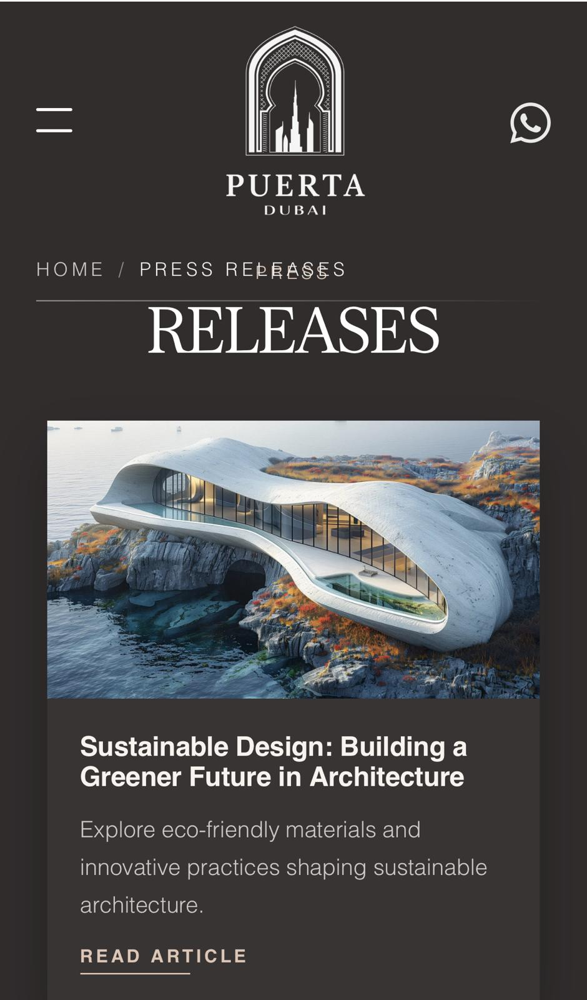
  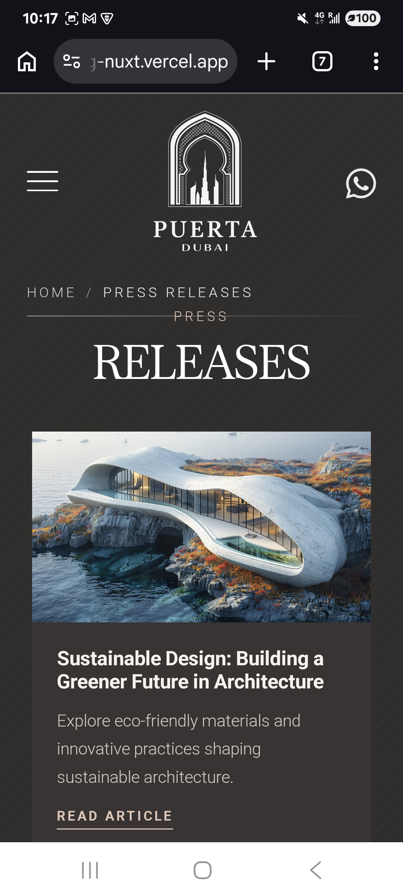

contraintes:
- ne demarrer qu'apres validation de la tache precedente

validation attendue:
- ecris `valide 15` pour autoriser le passage a la tache suivante

---
## Task 16

status: approved
instructions:
- sur la home mobile, la section Golden Visa manque de rythme: il y a beaucoup trop d'espace vide, le bouton est trop dissocie du visuel, et la transition avec la zone des logos manque de cohesion
- je veux une composition mobile plus compacte et mieux hiérarchisée, sans casser l'esthétique premium de la section
- voir captures :
  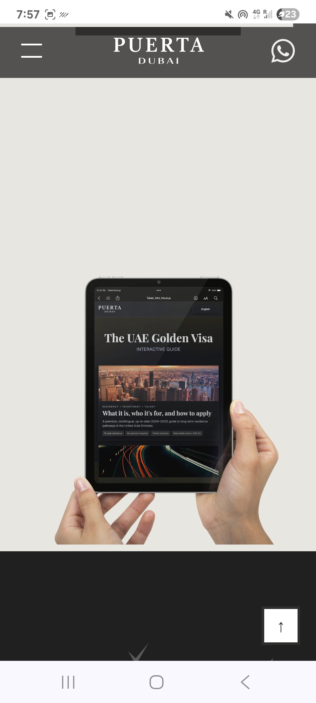
  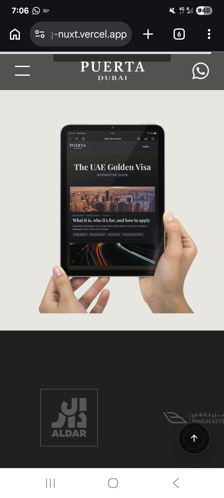
  

contraintes:
- ne demarrer qu'apres validation de la tache precedente

validation attendue:
- ecris `valide 16` pour autoriser le passage a la tache suivante

---
## Task 17

status: approved
instructions:
- sur les pages d'articles du blog en mobile, le hero est trop agressif: le grand titre se chevauche lui-meme, remonte sous le logo et rend la lecture confuse dès l'arrivée sur la page
- je veux une vraie version mobile du hero article, avec une typographie plus maîtrisée, un bloc titre lisible et une meilleure respiration entre image, titre et introduction
- voir capture :
  

contraintes:
- ne demarrer qu'apres validation de la tache precedente

validation attendue:
- ecris `valide 17` pour autoriser le passage a la tache suivante

---
## Task 18

status: approved
instructions:
- sur les pages detail projet en mobile, plusieurs sections ont un rythme vertical bancal: grands vides avant le contenu utile, blocs "highlights" qui arrivent trop bas, et certains visuels/cartes qui paraissent mal cadres ou mal enchaines
- je veux une passe d'optimisation mobile sur l'espacement et l'enchainement de ces sections pour rendre la lecture plus fluide et plus dense
- voir captures :
  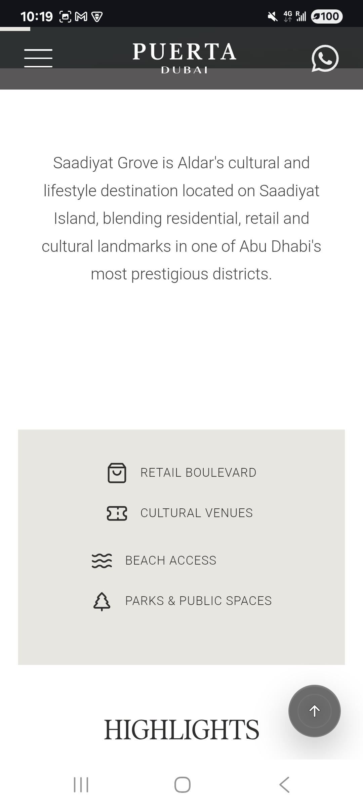
  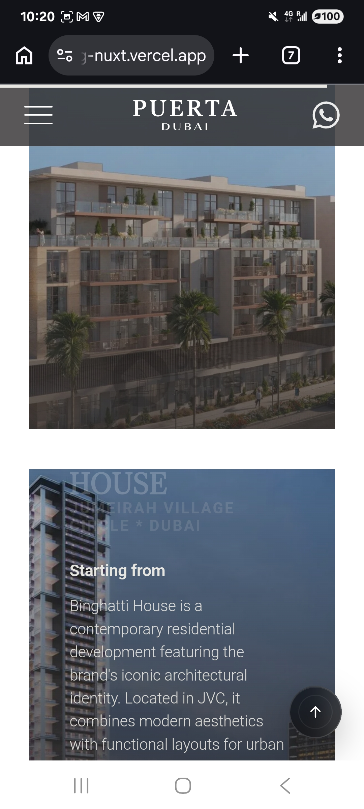

contraintes:
- ne demarrer qu'apres validation de la tache precedente

validation attendue:
- ecris `valide 18` pour autoriser le passage a la tache suivante

---
## Task 19

status: approved
instructions:
- sur la version mobile, le selecteur de langue disparait de la barre de navigation du haut
- je veux que, lorsqu'il n'est plus affiche dans le header mobile, il soit reintegre proprement dans le menu lateral ouvert, avec une presentation coherente avec le reste de la navigation

contraintes:
- ne demarrer qu'apres validation de la tache precedente

validation attendue:
- ecris `valide 19` pour autoriser le passage a la tache suivante

---
## Task 20

status: approved
instructions:
- dans les pages details de projets, sur la version mobile, il faut desactiver le deplacement de la carte OpenStreetMap au balayage pour ne pas perturber le scroll utilisateur dans la page

contraintes:
- ne demarrer qu'apres validation de la tache precedente

validation attendue:
- ecris `valide 20` pour autoriser le passage a la tache suivante

---
## Task 21

status: approved
instructions:
- dans `tasks-assets/golden-visa`, deux versions HTML du guide ont ete deposees : `golden-visa.html` et `golden-visa--.html`
- je veux que tu les analyses, que tu fusionnes leurs points forts en un seul refactoring propre et que tu identifies une structure cible claire pour une future integration Nuxt
- le resultat doit reprendre le contenu riche, la logique d'accordeons / sections / tableaux du guide, ainsi que les elements utiles deja prevus pour les actions rapides, le telechargement et la dimension multilingue
- avant de coder la route finale, il faut donc produire une version unifiee, coherente et propre a integrer au projet
- voir fichiers sources :
  
  

contraintes:
- ne demarrer qu'apres validation de la tache precedente
- ne pas exposer ce guide depuis le menu principal du site

validation attendue:
- ecris `valide 21` pour autoriser le passage a la tache suivante

---
## Task 22

status: approved
instructions:
- je veux que le guide Golden Visa soit integre au projet Nuxt dans une route dediee, separee du site public principal et non accessible depuis le menu principal
- cette page doit reprendre le design system du site Puerta Dubai: couleurs, typos, niveau de finition, composants visuels, ambiance premium et coherence avec le reste du front
- le guide doit etre refactorise comme une vraie page du projet, pas comme un bloc HTML isole colle tel quel
- il doit aussi embarquer le selecteur de langues de traduction deja gere avec Google Translate, avec une integration propre a cette page

contraintes:
- ne demarrer qu'apres validation de la tache precedente
- la route ne doit pas etre indexee ni rendue visible dans la navigation principale

validation attendue:
- ecris `valide 22` pour autoriser le passage a la tache suivante

---
## Task 23

status: approved
instructions:
- lorsqu'un utilisateur s'inscrit sur le site via le formulaire prevu pour acceder au guide, il doit recevoir un email de confirmation HTML
- cet email doit reprendre l'identite Puerta Dubai, avec le logo, une confirmation claire de son inscription, un recapitulatif des informations qu'il a renseignees, et un lien permettant d'acceder au guide Golden Visa
- je veux un vrai template email HTML propre, pas un email purement technique ou minimaliste

contraintes:
- ne demarrer qu'apres validation de la tache precedente
- le lien envoye par email doit pointer vers la route privee du guide et s'inserer dans le parcours d'acces final

validation attendue:
- ecris `valide 23` pour autoriser le passage a la tache suivante

---
## Task 24

status: approved
instructions:
- lorsqu'un utilisateur clique sur le lien recu par email, il arrive sur la route du guide Golden Visa mais ne doit pas acceder directement au contenu
- je veux un ecran de verification simple ou il doit renseigner son adresse email pour acceder au guide
- a ce moment-la, il faut verifier que cet email existe bien dans la table des leads; si l'email est reconnu, la consultation du guide s'ouvre, sinon l'acces est refuse proprement
- le guide ne doit donc pas etre public: l'acces doit etre reserve aux leads enregistres

contraintes:
- ne demarrer qu'apres validation de la tache precedente
- l'experience doit rester fluide et premium, meme si l'utilisateur n'est pas reconnu

validation attendue:
- ecris `valide 24` pour autoriser le passage a la tache suivante

---
## Task 25

status: approved
instructions:
- une fois la route privee et le controle d'acces en place, je veux une passe de finition sur l'experience complete du guide Golden Visa
- cela inclut la coherence entre la page d'accroche sur la home, le formulaire, l'email de confirmation, l'arrivee sur la route du guide, l'etape de verification par email, puis la consultation du guide lui-meme
- il faut aussi verifier que la traduction via Google Translate, les textes systeme, les messages d'erreur, les CTA et les retours utilisateur restent coherents sur tout ce parcours

contraintes:
- ne demarrer qu'apres validation de la tache precedente
- conserver une logique non publique et premium de bout en bout

validation attendue:
- ecris `valide 25` pour autoriser le passage a la tache suivante

---
## Task 26

status: approved
instructions:
- sur la version mobile de la section "our services" de l'accueil, je veux une meilleure tenue de la composition
- l'image de fond doit rester collee a la fenetre uniquement pour cette section, sans impacter le reste de la mise en page ou de la grille globale
- pour le titre "our services", le mot "our" ne doit pas se decaler visuellement

contraintes:
- ne demarrer qu'apres validation de la tache precedente
- le comportement specifique du fond doit rester limite a cette section uniquement

validation attendue:
- ecris `valide 26` pour autoriser le passage a la tache suivante

---
## Task 27

status: in_progress
instructions:
- je veux une optimisation de la popup de preinscription pour qu'elle paraisse plus premium
- il faut fixer le bouton `close` en haut a droite de la fenetre de popup
- il faut aussi revoir la couleur du texte au survol du bouton de validation du formulaire pour que cela reste lisible
- plus globalement, je veux une passe de design plus haut de gamme sur cette popup

contraintes:
- ne demarrer qu'apres validation de la tache precedente
- conserver une ergonomie correcte sur mobile et desktop

validation attendue:
- ecris `valide 27` pour autoriser le passage a la tache suivante
